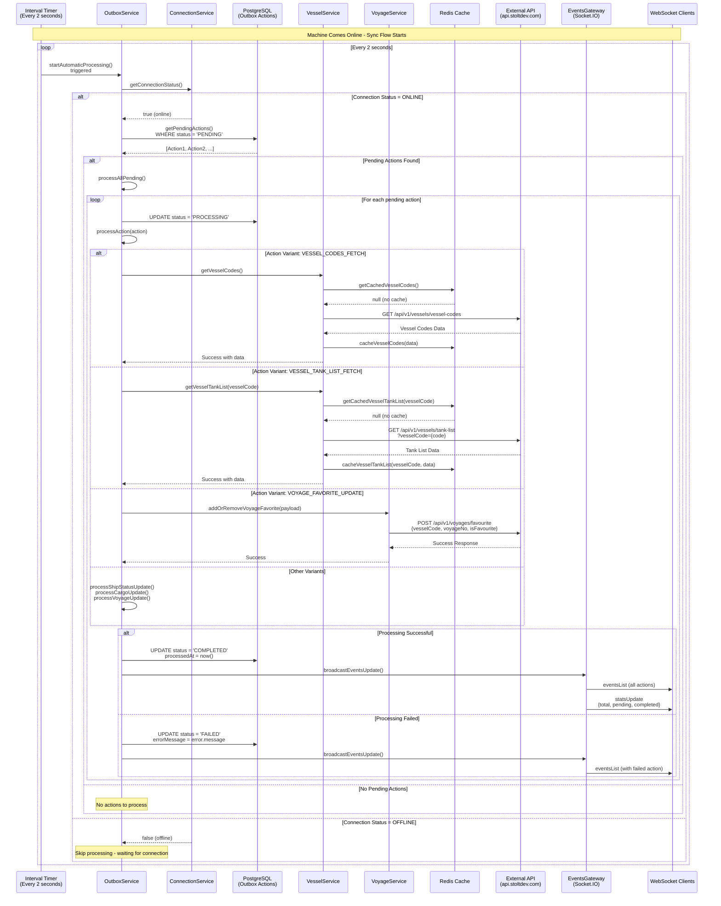
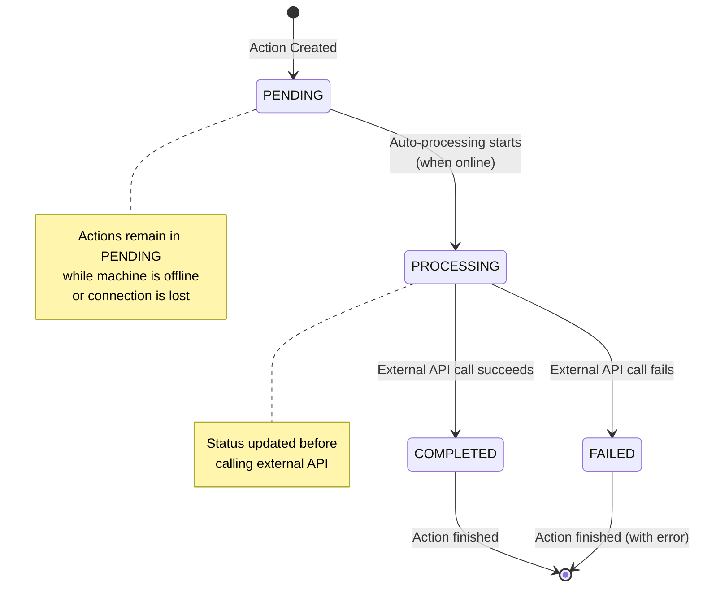
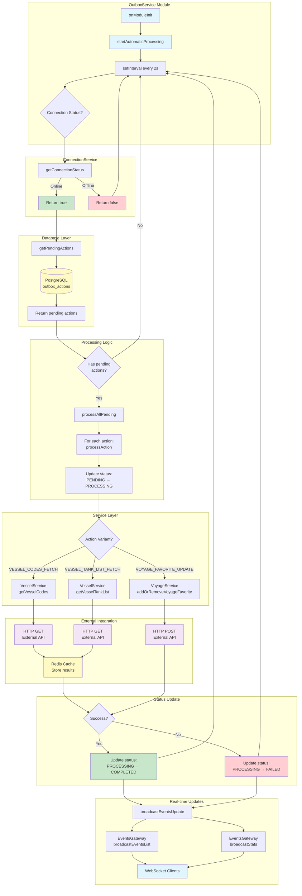

# Outbox Pattern Sync Flow Diagram

## Flow: Data Syncing When Machine Comes Online

## State Diagram: Action Lifecycle

## Component Interaction Flow

## Key Points

1. **Automatic Processing**: The `startAutomaticProcessing()` method runs every 2 seconds via `setInterval`
2. **Connection Check**: Before processing, it checks `ConnectionService.getConnectionStatus()` to ensure machine is online
3. **Database Query**: Fetches all actions with `status = 'PENDING'` from PostgreSQL
4. **Sequential Processing**: Each action is processed one by one (not in parallel)
5. **Status Transitions**: Actions move through states: `PENDING` → `PROCESSING` → `COMPLETED`/`FAILED`
6. **External API Calls**: Based on action variant, calls appropriate service method which makes HTTP requests to external APIs
7. **Caching**: Successful API responses are cached in Redis for offline access
8. **Real-time Updates**: After each action is processed, WebSocket broadcasts update all connected clients
9. **Error Handling**: Failed actions are marked as `FAILED` with error message stored
10. **Offline Resilience**: When offline, processing is skipped but actions remain in `PENDING` state for when connection is restored
